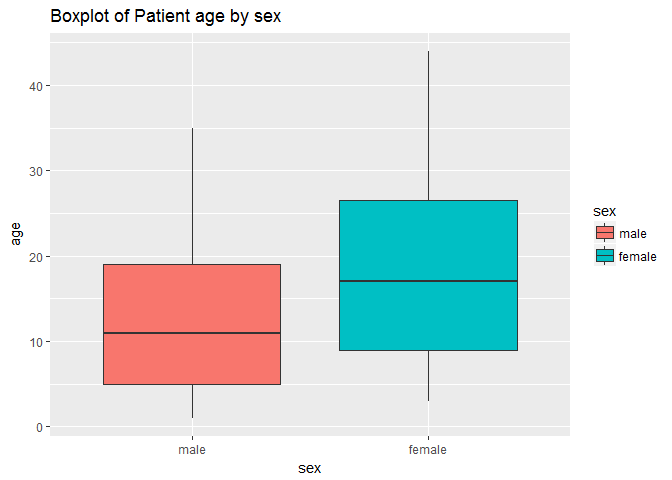

Introduction to R | Descriptive Statistics
================
EcoHealth Alliance


Contents
--------

[Quantitative vs qualitative data](#qvq)

[Measures of central tendency](#cent)

[Measures of dispersion](#varmes)

[Frequency distributions](#freq)

[Barplot](#bar)

[Histogram](#hist)

[Boxplot](#box)

### <a name = "qvq"><a/> Quantitative vs qualitative data

Data can be separated into two categories depending on how they represent observations or measurements of a given variable.

Data is *quantitative* if measurements can be represented numerically, in other words if data can be quantified (e.g. age, weight, height).Furthermore, *quantitative* data can be either *continuous* if it can take any value within a range (e.g. height, weight) or *discrete* if it can only take specific values (e.g. age). *Qualitative* data on the other hand, refers to non-numerical, nominal data (e.g. sex, yes-no answers).

It is important to understand the differences between these types of data in order to properly choose the statistical analyses to be applied. We will focus primarily related to quantitative data and will briefly touch on descriptive methods for qualitative data.

### <a name = "cent"><a/> Measures of central Tendency

As we saw in the previous section, we can get a general idea of the distribution of our data using the `summary()` function.

``` r
summary(cgd)
```

    ##        id                          center       random          
    ##  Min.   :  1.00   NIH                 :41   Min.   :1989-06-07  
    ##  1st Qu.: 24.50   Scripps Institute   :36   1st Qu.:1989-08-19  
    ##  Median : 54.00   Amsterdam           :28   Median :1989-09-15  
    ##  Mean   : 58.09   Univ. of Zurich     :21   Mean   :1989-09-22  
    ##  3rd Qu.: 89.50   Mott Children's Hosp:20   3rd Qu.:1989-11-03  
    ##  Max.   :135.00   L.A. Children's Hosp:13   Max.   :1989-12-29  
    ##                   (Other)             :44                       
    ##      treat         sex           age           height     
    ##  placebo:120   male  :168   Min.   : 1.0   Min.   : 76.3  
    ##  rIFN-g : 83   female: 35   1st Qu.: 6.0   1st Qu.:114.5  
    ##                             Median :12.0   Median :140.0  
    ##                             Mean   :13.7   Mean   :138.1  
    ##                             3rd Qu.:20.0   3rd Qu.:169.2  
    ##                             Max.   :44.0   Max.   :189.0  
    ##                                                           
    ##      weight            inherit       steroids          propylac     
    ##  Min.   : 10.40   X-linked :131   Min.   :0.00000   Min.   :0.0000  
    ##  1st Qu.: 20.25   autosomal: 72   1st Qu.:0.00000   1st Qu.:1.0000  
    ##  Median : 33.40                   Median :0.00000   Median :1.0000  
    ##  Mean   : 39.34                   Mean   :0.03448   Mean   :0.8473  
    ##  3rd Qu.: 58.70                   3rd Qu.:0.00000   3rd Qu.:1.0000  
    ##  Max.   :101.50                   Max.   :1.00000   Max.   :1.0000  
    ##                                                                     
    ##              hos.cat        tstart           enum           tstop      
    ##  US:NIH          : 41   Min.   :  0.0   Min.   :1.000   Min.   :  4.0  
    ##  US:other        :108   1st Qu.:  0.0   1st Qu.:1.000   1st Qu.:204.5  
    ##  Europe:Amsterdam: 28   Median :  0.0   Median :1.000   Median :273.0  
    ##  Europe:other    : 26   Mean   : 69.5   Mean   :1.665   Mean   :254.1  
    ##                         3rd Qu.:121.0   3rd Qu.:2.000   3rd Qu.:320.0  
    ##                         Max.   :373.0   Max.   :8.000   Max.   :439.0  
    ##                                                                        
    ##      status      
    ##  Min.   :0.0000  
    ##  1st Qu.:0.0000  
    ##  Median :0.0000  
    ##  Mean   :0.3744  
    ##  3rd Qu.:1.0000  
    ##  Max.   :1.0000  
    ## 

However, we notice that measures of central tendency (mean and median) are only given for quantitative variables.

We can also calculate these values for specific variables via the `mean()` and `median()` functions.

``` r
mean(cgd$weight)               # mean weight
```

    ## [1] 39.34286

``` r
median(cgd$weight)             # median for weight
```

    ## [1] 33.4

We can also take a look at the proportion of our data that falls under certain values. Quartiles divide our data into four equal parts, the first or lower quartile cuts off the first 25% of the data, the second quartile (or median) cuts at 50%, and the upper (third) quartile at 75%.

``` r
quantile(cgd$weight) # will show us the quartile distribution of our data
```

    ##     0%    25%    50%    75%   100% 
    ##  10.40  20.25  33.40  58.70 101.50

In essence percentiles act the same as quartiles except these divide our data into 100 equal groups. We can use percentiles to visualize what value cuts 95% of our data for example.

``` r
quantile(cgd$weight, 0.95) # shows us the 95th percentile
```

    ##   95% 
    ## 73.95

We are also able to get a general idea of the range within the majority (75%) of our data lies by computing the *interquartile range*

``` r
IQR(cgd$weight)
```

    ## [1] 38.45

### EXERCISE 1

1.  Upload the *iris* dataframe
2.  What is the mean value for Petal.Width? The median?
3.  Calculate the quartiles for Sepal.Width
4.  Calculate the 10th and 90th percentile for Sepal.Length
5.  Determine the interquartile range for Petal.Width

<a name = "varmes"><a/> Measures of dispersion
----------------------------------------------

To further understand the distribution of our data we need to know how much it varies. We can do this using measures of dispersion.

*Variance* is a measure of how much our data is dispersed around the mean. In other words, it is the average distances of our sample values from the mean. This helps us understand how much variation is there within our sample population.

``` r
var(cgd$weight)
```

    ## [1] 476.3818

*Standard deviation* is the square root of the variance. Many times it is preferred to represent variation since it usually yields more manageable values than the variance. However, both values are equally valid and may be used to assess variation within a particular population.

``` r
sd(cgd$weight)
```

    ## [1] 21.82617

### EXERCISE 2

1.  Calculate the variance and standard deviation for Petal.Length.

### <a name = "freq"><a/> Frequency distributions

The distribution of data set allows us to observe the possible range of values and how often these occur within our sample population. Depending on the type of variable we are dealing with, we may choose different methods to visualize them. We will use the **ggplot2** R package to visualize our data.

------------------------------------------------------------------------

### <a name = "bar"><a/> Barplot

When dealing with qualitative variables we use barplots or bargraphs. Here, the *x*-axis is discrete and represents our categories while the *y*-axis represents counts. We will now create a barplot to visualize the number of male and female patients in the *cgd* database.

``` r
library(ggplot2)

ggplot(data = cgd, aes(x = sex)) + geom_bar(stat = "count") #geom_bar creates the barplot. The stat parameter indicates what is to be plotted
```


We can modify plot appearance and add a title

``` r
ggplot(data = cgd, aes(x = sex)) + 
  geom_bar(fill = "#FF9999", width = 0.5, stat = "count") + #change color and bar width
  ggtitle("Patient sex")                                    #add title
```


Click [here](http://www.cookbook-r.com/Graphs/Colors_(ggplot2)/) for more information on ggplot colors.

### EXCERCISE 3

1.  Using the *iris* dataframe create a barplot of Species frequency.

### <a name = "hist"><a/> Histogram

To plot quantitative data however, we use histograms. The approach is fairly similar to creating barplots except we will substitute `geom_bar()` with `geom_histogram()`. Let's plot the distribution of weights for our cgd patients.

``` r
ggplot(data = cgd, aes(x = weight)) + 
  geom_histogram(binwidth = 20, fill = "white", colour = "black") +
  ggtitle("Patient weights") # binwidth indicates how large our groups are
```


Adding a line for the mean:

``` r
ggplot(data = cgd, aes(x = weight)) + 
  geom_histogram(binwidth = 20, fill = "white", colour = "black") +
  geom_vline(aes(xintercept = mean(weight)), color = "red") + #geom_vline adds vertical line
  ggtitle("Patient weights")
```


Furthermore, we may also want to compare distributions between populations, for example ages between female and male patients.

``` r
ggplot(data = cgd, aes(x = age, fill= sex)) +
  geom_histogram(binwidth = 10, alpha = 0.5, position = "identity") +
  ggtitle("Patient age by sex")
```


We could also visualize this as density plots

``` r
ggplot(data = cgd, aes(x = age, fill = sex)) + 
  geom_density(alpha = 0.3) +
  ggtitle("Density plot of ages by sex")
```


### EXCERCISE 4

Using the *iris* dataframe:

1.  Create a histogram for Sepal width
2.  Create overlapping density plots for Petal length by species.

------------------------------------------------------------------------

<a name = "box"><a/>Box Plots
-----------------------------

We can also graphically represent the distribution of our quantitative data by creating boxplots. These will allow us to visualize quartiles, the mean, and general variation of our data.

Once again we will compare distribution of ages among female and male cgd patients.

``` r
ggplot(data = cgd, aes(x = sex, y = age, fill = sex)) + #note x and y are inverted now
  geom_boxplot() + ggtitle("Boxplot of Patient age by sex")
```



### EXCERCISE 5

Using the *iris* database:

1.  Create a boxplot for Petal Length by species. How does this compare to the histogram from the previous exercise?

For more on ggplot graphs refer to [Rcookbook](http://www.cookbook-r.com/Graphs/).

------------------------------------------------------------------------
